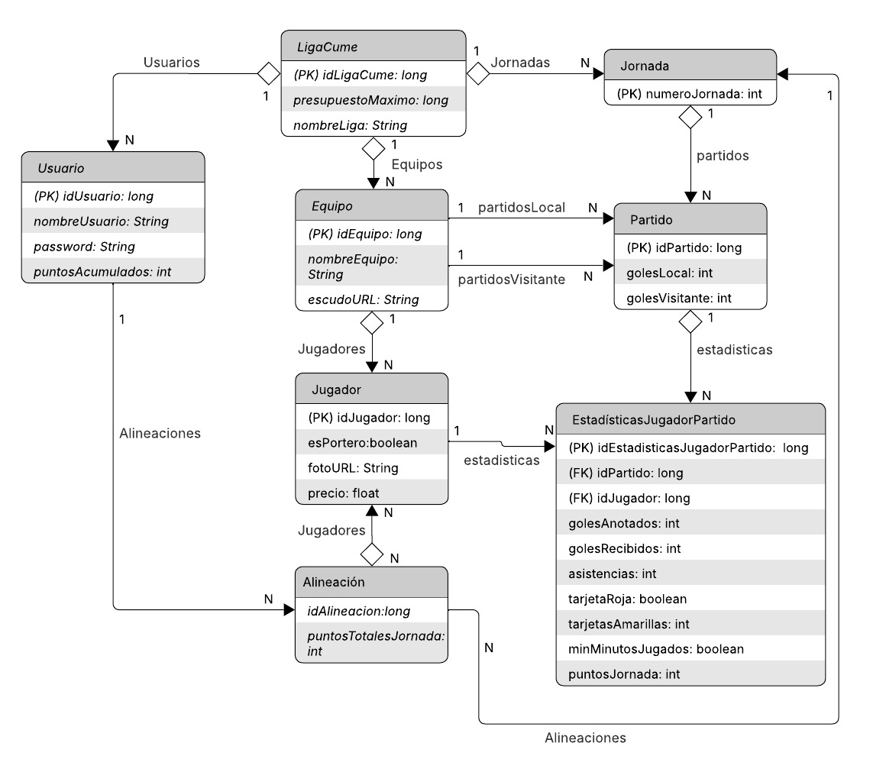

# ⚽ Fantasy Fútbol Sala – Centro Universitario de Mérida  

## 📌 Logo
  

---

## 👨‍💻 Desarrolladores
- **Javier Conejero Rodríguez** – DNI: 09208376G  
    

- **Miguel Cendrero Calderón** – DNI: 09217200L  
    

---

## 🏆 Eslogan
**Convierte a tus compis en leyendas**  

---


## 📋 Descripción
Aplicación web que permite a los usuarios competir entre ellos por ser el manager con mejor ojo de la universidad.
Cada manager deberá realizar una alineación para cada jornada eligiendo los 5 jugadores de toda la liga que mejor partido consideran que harán. 
Cada jornada cada manager tendrá el mismo presupuesto limitado y deberá combinar en cada jornada los 5 jugadores de la liga que mejor jugarán
para obtener la máxima puntuación posible sin sobrepasar su presupuesto. 

Cada manager deberá:  
- Realizar una alineación para cada jornada.  
- Seleccionar **5 jugadores** de toda la liga que mejor rendimiento puedan tener.  
- Ajustarse a un **presupuesto limitado** por jornada.  

### 📊 Criterios de puntuación
- **Goles anotados**  
- **Asistencias dadas**  
- **Tarjetas amarillas**  
- **Tarjetas rojas**  
- **Minutos disputados**  
- **Portería a cero (solo porteros)**  

### 👨‍💼 Rol de administrador
Los administradores serán tambien los **propios usuarios** (organizadores de la liga) serán responsables de:  
- Dar de alta equipos y jugadores.  
- Actualizar los resultados de cada jornada.  
- Gestionar las estadísticas de jugadores.  
- Generar automáticamente el calendario de enfrentamientos (ida y vuelta).  

---

## ✅ Funcionalidades, Requisitos y Pliego de Condiciones  

### Funcionalidad 1. Gestión de equipos  
- [ ] 1.1 Agregar equipos
- [ ] 1.2 Modificar equipos
- [ ] 1.3 Eliminar equipos
- [ ] 1.4 Listar equipos

### Funcionalidad 2. Gestión de jugadores  
- [ ] 2.1 Agregar jugadores a un equipo
- [ ] 2.2 Actualizar información de jugadores
- [ ] 2.3 Eliminar jugadores de un equipo
- [ ] 2.4 Listar jugadores

### Funcionalidad 3. Gestión de partidos  
- [ ] 3.1 Agregar resultados de partidos por jornada
- [ ] 3.2 Modificar resultados de partidos por jornada

### Funcionalidad 4. Estadísticas de jugadores  
- [ ] 4.1 Añadir estadísticas de jugadores por partido
- [ ] 4.2 Modificar estadísticas de jugadores por partido

### Funcionalidad 5. Calendario de enfrentamientos  
- [ ] 5.1 Generar cuadro de enfrentamientos por jornada

### Funcionalidad 6. Crear alineacion para la jornada  
- [ ] 6.1 Listar jugadores disponibles por posición
- [ ] 6.2 Seleccionar jugador por posición
- [ ] 6.3 Consultar equipo alineado

### Funcionalidad 7. Consultar estadísticas generales de jugadores 
- [ ] 7.1 Buscar jugador (filtrar por nombre, puntos o equipo)

### Funcionalidad 8. Ver clasificación general  
- [ ] Consultar ranking de todos los usuarios

### Funcionalidad 9. Ver Resultados  
- [ ] Ver resultados de partidos disputados

### Funcionalidad 10. Puntuaciones de usuarios por jornada
- [ ] Consultar puntuación total de la jornada.
- [ ] Mostrar jugadores seleccionados y sus respectivas puntuaciones.

---

## 🌟 Funcionalidades Opcionales, Recomendables o Futuribles  

### **Opcional 1.** Implementar login diferenciado entre **usuario** y **administrador** de forma que se diferencie la lógica de jugador y de administrador.

### **Opcional 2.** Sistema recomendador de jugadores usando **IA**  

### **Opcional 3.**  Implementar otro modo de juego fantasy que incluya un mercado diario y los jugadores compitan por adquirir los jugadores para sus equipos. (Esta lógica se denomina Liga Fantasy, en nuestra aplicación es desarrollada un modo de juego similar al de liga fantastica)


---

## 🆕 Nuevas Funcionalidades Implementadas (Noviembre 2025)

### ⚽ **1. Clasificación de Equipos**
Sistema completo de clasificación de equipos basado en resultados de partidos:

**Características:**
- ✅ **Tabla de clasificación dinámica** ordenada por puntos, diferencia de goles y goles a favor
- ✅ **Sistema de puntuación**: Victoria (+3), Empate (+1), Derrota (0)
- ✅ **Estadísticas completas**: PJ, V, E, D, GF, GC, DIF, PTS
- ✅ **Visualización de escudos** de equipos en la tabla
- ✅ **Actualización automática** tras agregar resultados de partidos
- ✅ **Diseño moderno** con gradientes azulados y efectos visuales

**Ubicación:** Menú lateral → Clasificación

---

### 📊 **2. Agregar Resultados de Partidos (Administrador)**
Sistema completo para que los administradores registren resultados y estadísticas:

**Características:**
- ✅ **Selector de jornadas** mediante desplegable interactivo
- ✅ **Vista de partidos por jornada** con equipos y escudos
- ✅ **Edición de estadísticas por jugador**:
  - Goles anotados
  - Asistencias
  - Tarjetas amarillas (0, 1 o 2)
  - Tarjetas rojas (checkbox)
  - Minutos jugados (checkbox)
  - Goles encajados (solo porteros, se actualiza automáticamente)
- ✅ **Actualización automática del marcador** al agregar goles
- ✅ **Recálculo automático** de:
  - Puntos de usuarios
  - Clasificación de equipos
  - Estadísticas de jugadores
- ✅ **Interfaz intuitiva** con modal de edición para cada partido

**Ubicación:** Menú lateral → Opciones Admin → Agregar Resultados

---

### 🔄 **3. Movimiento Automático de Alineaciones**
Sistema inteligente que gestiona las alineaciones futuras:

**Funcionamiento:**
- ✅ Cuando se agrega el **primer resultado** de una jornada
- ✅ Las **alineaciones futuras** se mueven automáticamente al **historial**
- ✅ La próxima **alineación futura** pasa a la **siguiente jornada**
- ✅ Los usuarios **no pierden** sus alineaciones configuradas
- ✅ **Sincronización automática** entre jornadas

**Ejemplo:**
```
Usuario configura alineación para Jornada 1
    ↓
Admin agrega resultados de Jornada 1
    ↓
Alineación se mueve automáticamente a Historial (Jornada 1) ✅
Alineación Futura ahora es Jornada 2 ✅
```

---

### 💰 **4. Cambiar Presupuesto Máximo (Administrador)**
Funcionalidad para modificar el presupuesto de la liga:

**Características:**
- ✅ **Modal interactivo** con JavaScript
- ✅ **Input numérico** con formato y validación
- ✅ **Validaciones en cliente y servidor**:
  - Presupuesto mínimo: 500.000€
  - Validación de valores no nulos
  - Confirmación antes de guardar
- ✅ **Actualización en tiempo real** en todas las vistas
- ✅ **Formato de moneda** con separadores de miles
- ✅ **Feedback visual** con alertas de éxito/error

**Ubicación:** Menú lateral → Opciones Admin → Cambiar Presupuesto

**Integración:**
- El nuevo presupuesto se refleja automáticamente en "Alineación Futura"
- Todos los usuarios ven el mismo presupuesto actualizado
- Persistencia en base de datos

---

### 🔄 **5. Reiniciar Liga (Mejorado)**
Funcionalidad mejorada para reiniciar competiciones:

**Características:**
- ✅ **Confirmación de seguridad** antes de ejecutar
- ✅ **Reseteo completo** de:
  - Todas las estadísticas de jugadores a 0
  - Clasificación de equipos a 0
  - Puntos de usuarios a 0
  - Eliminación de todas las jornadas
  - Regeneración de calendario (ida y vuelta)
- ✅ **Preservación** de:
  - Jugadores y equipos existentes
  - Usuarios de la liga
  - Configuración de presupuesto
- ✅ **Mensaje de advertencia** claro sobre la operación

**Ubicación:** Menú lateral → Opciones Admin → Reiniciar Liga

---

### 🤖 **6. Alineación SugerIA (Recomendador con IA)**

Sistema de recomendaciones de alineaciones usando **Inteligencia Artificial** (OpenRouter - Nemotron 70B Instruct).

#### 🌟 Características principales

- ✅ **IA de última generación** - Usa el modelo Nemotron 70B Instruct vía OpenRouter
- ✅ **Análisis completo** - Evalúa todos los jugadores de la liga
- ✅ **Recomendaciones personalizadas** - Saludo por nombre del manager
- ✅ **Justificación detallada** - Explica por qué recomienda cada jugador
- ✅ **Control de presupuesto** - Respeta el límite económico de la liga
- ✅ **Regenerable** - Puedes solicitar nuevas recomendaciones

#### 🛠️ Configuración

Debes configurar tu API key de OpenRouter en `src/main/resources/application.properties`:

```properties
# --- Configuración de OpenRouter AI ---
openrouter.api.key=sk-or-v1-TU_CLAVE_AQUI
openrouter.api.url=https://openrouter.ai/api/v1/chat/completions
openrouter.model=nvidia/llama-3.1-nemotron-70b-instruct
```

⚠️ **IMPORTANTE**: 
- Nunca subas tu API key a repositorios públicos
- OpenRouter ofrece créditos gratuitos para empezar
- Puedes cambiar el modelo si lo deseas (ej: `anthropic/claude-3.5-sonnet`, `openai/gpt-4`, etc.)

Para obtener una API key:
1. Visita [OpenRouter](https://openrouter.ai/)
2. Regístrate o inicia sesión
3. Ve a la sección **"Keys"**
4. Haz clic en **"Create Key"**
5. Copia la clave generada (comienza con `sk-or-v1-...`)

#### 📍 Uso desde la interfaz

1. Accede a cualquier vista de la liga
2. Inicia sesión como usuario
3. En el menú lateral, haz clic en **"Alineación SugerIA"** (ícono de robot 🤖)
4. Espera unos segundos mientras la IA analiza los datos
5. Revisa la recomendación personalizada
6. Puedes regenerar la recomendación si lo deseas

#### 🧠 Cómo funciona

##### Proceso de análisis

1. **Recopilación de datos**: El servicio obtiene todos los jugadores de la liga con sus estadísticas
2. **Construcción del contexto**: Se crea un prompt detallado con:
   - Información de todos los porteros (goles recibidos, tarjetas, puntos)
   - Información de jugadores de campo (goles, asistencias, tarjetas, puntos)
   - Presupuesto máximo disponible
   - Reglas y restricciones
3. **Consulta a la IA**: Se envía el contexto a Nemotron 70B vía OpenRouter
4. **Procesamiento de respuesta**: La IA devuelve una recomendación estructurada

##### Criterios de evaluación de la IA

La IA considera múltiples factores:

- ✅ **Rendimiento**: Jugadores con más goles, asistencias y puntos
- ✅ **Disciplina**: Evita jugadores con muchas tarjetas
- ✅ **Porteros**: Prioriza los que menos goles reciben
- ✅ **Presupuesto**: Optimiza el uso del dinero disponible
- ✅ **Balance**: Busca un equipo equilibrado

#### 📊 Formato de respuesta

La IA devuelve una respuesta estructurada con:

```
🎯 ALINEACIÓN RECOMENDADA

PORTERO:
• Nombre - Equipo - Precio: X€
  Razón: [Explicación]

JUGADORES DE CAMPO:
• Jugador 1 - Equipo - Precio: X€
  Razón: [Explicación]
• Jugador 2 - Equipo - Precio: X€
  Razón: [Explicación]
• Jugador 3 - Equipo - Precio: X€
  Razón: [Explicación]
• Jugador 4 - Equipo - Precio: X€
  Razón: [Explicación]

💰 RESUMEN ECONÓMICO:
Coste Total: X€
Presupuesto Disponible: X€
Saldo Restante: X€

📊 ANÁLISIS:
[Explicación de por qué esta es la mejor alineación]
```

#### 🔧 Componentes técnicos

- **IAService.java**: Gestiona la comunicación con OpenRouter API
- **IAController.java**: Controlador REST que expone los endpoints
- **alineacionSugerIA.html**: Vista Thymeleaf con diseño atractivo

#### ⚠️ Limitaciones

- 🔒 **Requiere conexión a Internet** para consultar la API
- 💰 **Límites de uso**: OpenRouter tiene cuotas según tu plan
- ⏱️ **Tiempo de respuesta**: Puede tardar 2-5 segundos
- 🔐 **Seguridad**: La API key debe protegerse adecuadamente

#### 🐛 Solución de problemas

**Error: "API key not found"**
- Verifica que hayas configurado correctamente la API key en `application.properties`

**Error: "Failed to generate content"**
- API key inválida o expirada
- Límite de cuota excedido
- Problemas de conexión a Internet

#### 📚 Recursos adicionales

- [Documentación oficial de OpenRouter](https://openrouter.ai/docs)
- [OpenRouter Dashboard](https://openrouter.ai/)
- [Modelos disponibles](https://openrouter.ai/models)
- [Nemotron 70B Instruct](https://openrouter.ai/models/nvidia/llama-3.1-nemotron-70b-instruct)

---

### 🎨 **7. Mejoras Visuales Generales**

**Menú Lateral:**
- ✅ Nombre de la liga dinámico en el encabezado
- ✅ Gradiente moderno (púrpura → rosa → rojo)
- ✅ Iconos de Bootstrap Icons
- ✅ Efectos hover con animaciones suaves

**Tablas (Ranking y Clasificación):**
- ✅ Diseño con gradientes azulados
- ✅ Encabezados con color sólido (#4A90E2)
- ✅ Filas alternadas con colores diferenciados
- ✅ Efectos hover con elevación
- ✅ Badges para posiciones destacadas

**Desplegables de Jornadas:**
- ✅ Estilo consistente en toda la aplicación
- ✅ Colores acordes con el tema general
- ✅ Mejor visibilidad y usabilidad

**Imágenes:**
- ✅ Soporte para URLs de escudos de equipos
- ✅ Soporte para URLs de avatares de jugadores
- ✅ Ajuste automático de tamaños
- ✅ Fallback a avatares generados automáticamente

---

### 🛠️ **8. Validaciones y Manejo de Errores**

**Gestión de Equipos:**
- ✅ Validación de URLs de escudos (máximo 500 caracteres)
- ✅ Notificaciones al usuario si falta información
- ✅ Prevención de eliminación con datos inconsistentes

**Gestión de Jugadores:**
- ✅ Validación de URLs de avatares (máximo 500 caracteres)
- ✅ Validación de posición obligatoria
- ✅ Mensaje de error claro si falta información
- ✅ Modal de confirmación al eliminar (con validación de portero único)

**Agregar Resultados:**
- ✅ Prevención de parpadeo en modales de confirmación
- ✅ Validación de datos antes de guardar
- ✅ Manejo de errores de red con mensajes claros

#### 🚨 Página de Error Personalizada

Página de error profesional con diseño moderno integrada en toda la aplicación.

**Características:**
- ✅ Logo de la liga con animación pulse
- ✅ Icono de error animado con efecto shake
- ✅ Mensaje de error personalizado (parámetro GET)
- ✅ Diseño responsive (móvil, tablet, desktop)
- ✅ Botón para volver a la página principal
- ✅ Fondo degradado consistente con el tema
- ✅ Animaciones CSS suaves

**Ubicación:** `/error?error=mensaje`

**Uso desde código:**
```java
// Redirigir con mensaje personalizado
return "redirect:/error?error=" + URLEncoder.encode("Tu mensaje aquí", "UTF-8");
```

**Ejemplos:**
```
http://localhost:8080/error?error=unauthorized
http://localhost:8080/error?error=Sesión expirada
http://localhost:8080/error?error=No tienes permisos
```

**Integración con Spring Security:**
- Se activa automáticamente en errores de autenticación
- Muestra mensajes claros al usuario
- Redirección automática desde SecurityConfig

---

### 📱 **9. Responsive Design**

Todas las nuevas funcionalidades son **completamente responsive**:
- ✅ Adaptación automática a móviles, tablets y desktop
- ✅ Menú lateral colapsable en dispositivos pequeños
- ✅ Tablas con scroll horizontal en pantallas pequeñas
- ✅ Modales optimizados para todas las resoluciones

---

### 🔐 **10. Seguridad y Permisos (Spring Security)**

Sistema de seguridad completo basado en Spring Security 6.4 con autenticación por sesión HTTP.

#### Configuración de seguridad implementada:


**Protección de rutas:**
- ✅ `/liga/**` - Requiere autenticación (cualquier usuario logueado)
- ✅ `/`, `/index`, `/error` - Acceso público
- ✅ `/usuario/login`, `/usuario/registro` - Acceso público
- ✅ Recursos estáticos (`/css/**`, `/js/**`, `/images/**`, `/static/**`) - Acceso público

**Características:**
- ✅ Autenticación mediante sesión HTTP
- ✅ Contraseñas encriptadas con BCrypt
- ✅ SessionAuthenticationFilter personalizado
- ✅ Redirección automática según rol
- ✅ Manejo de sesiones
- ✅ Página de error personalizada para accesos no autorizados
- ✅ Logout funcional con limpieza de sesión

#### Flujo de autenticación

```
Usuario accede a /liga/1/ranking
    ↓
SessionAuthenticationFilter verifica la sesión HTTP
    ↓
¿Hay usuario en sesión?
    ↓ SÍ                    ↓ NO
Establecer autenticación   Spring Security bloquea
en Spring Security         Redirige a /?error=unauthorized
    ↓
Permitir acceso ✅
```

#### Componentes

1. **SecurityConfig.java**: Configuración principal de Spring Security
2. **SessionAuthenticationFilter.java**: Filtro que integra sesiones HTTP con Spring Security
3. **Usuario.java**: Entidad con campos `email`, `password` y `rol`
4. **UsuarioController.java**: Maneja login, registro y logout

**Acceso:**
- Login: `http://localhost:8080/`
- Registro: `http://localhost:8080/usuario/registro`

#### Pruebas de seguridad

**Test 1: Sin login (debe fallar)**
```bash
# Cierra el navegador completamente
# Accede a: http://localhost:8080/liga/1/ranking
# Resultado: Redirige a /?error=unauthorized ✅
```

**Test 2: Con login (debe funcionar)**
```bash
# Ve a: http://localhost:8080/
# Haz login con usuario válido
# Accede a: http://localhost:8080/liga/1/ranking
# Resultado: Muestra la página correctamente ✅
```

**Test 3: Recursos estáticos (siempre accesibles)**
```bash
# Accede sin login a:
http://localhost:8080/logoliga.png
http://localhost:8080/css/styles.css
# Resultado: Se cargan correctamente ✅
```

---

### 📦 **11. Sistema de Borrado de Equipos con Regeneración Automática**

Sistema inteligente para el borrado de equipos que verifica si la liga ha sido reiniciada antes de permitir la eliminación.

**Características:**
- ✅ Verifica estado de la liga antes de eliminar
- ✅ Si la liga está reiniciada (todos los partidos 0-0):
  - Elimina todas las alineaciones de las jornadas
  - Elimina todas las jornadas (y partidos en cascada)
  - Elimina el equipo
  - **Regenera automáticamente** los cuadros de competición para los equipos restantes
- ✅ Si la liga tiene resultados: Lanza excepción indicando que debe reiniciar la liga primero
- ✅ Usa el mismo algoritmo Round-Robin de generación de jornadas

**Flujo:**
```
Usuario solicita eliminar equipo
    ↓
¿El equipo existe?
    ↓ Sí
¿La liga tiene una liga asociada?
    ↓ Sí
¿La liga está reiniciada? (todos los partidos 0-0)
    ↓ Sí
1. Eliminar alineaciones de todas las jornadas
    ↓
2. Eliminar todas las jornadas (partidos en cascada)
    ↓
3. Eliminar el equipo
    ↓
4. ¿Quedan al menos 2 equipos?
    ↓ Sí
5. Regenerar cuadros de competición (Round-Robin)
    ↓
Éxito: Equipo eliminado y jornadas regeneradas ✅
```

**Casos de uso:**

**Caso 1: Liga Reiniciada con Suficientes Equipos**
```
Estado: Liga con 4 equipos, todos los partidos 0-0
Acción: Eliminar "Equipo A"
Resultado:
  ✓ Se eliminan alineaciones
  ✓ Se eliminan jornadas
  ✓ Se elimina "Equipo A"
  ✓ Se regeneran jornadas para los 3 equipos restantes
```

**Caso 2: Liga con Resultados**
```
Estado: Liga con 4 equipos, hay partidos con resultados
Acción: Eliminar "Equipo A"
Resultado:
  ✗ Error: "No se puede eliminar el equipo porque la liga ya 
    tiene resultados registrados. Para eliminar el equipo, 
    primero debes reiniciar la liga."
```

**Integración:**
- Compatible con JornadaController (mismo algoritmo Round-Robin)
- Sin dependencias circulares
- Validaciones en cascada correctas

---

### 📈 **12. Rendimiento y Optimización**

- ✅ **Carga lazy** de relaciones en entidades JPA
- ✅ **Queries optimizadas** para reducir consultas a BD
- ✅ **Caché de objetos** frecuentemente usados
- ✅ **JavaScript modular** para mejor mantenibilidad

---

## 📦 **Tecnologías Usadas en las Nuevas Funcionalidades**

**Backend:**
- Spring Boot 4.0.0
- Spring Security 6.4
- Spring Data JPA
- Hibernate 7.1.8
- MySQL 9.5
- BCrypt Password Encoder

**Frontend:**
- Thymeleaf 3.1.3
- Bootstrap 5.3.0
- Bootstrap Icons 1.11.0
- JavaScript ES6+
- Fetch API para llamadas AJAX

**IA:**
- OpenRouter API
- Modelo: Nemotron 70B Instruct (nvidia/llama-3.1-nemotron-70b-instruct)

**Base de Datos:**
- MySQL con soporte para URLs largas
- Migraciones SQL para actualización de esquema

---

## Diagrama entidad-relación de la base de datos
  

---


## 🏗️ Arquitectura y Modelo de Datos

### 📦 Entidades del Sistema

#### **LigaCume** (Liga Principal)
- `idLigaCume` (Long) - ID autoincremental
- `nombreLiga` (String) - Nombre de la liga
- `presupuestoMaximo` (Long) - Presupuesto máximo por jornada
- Relaciones:
    - `@OneToMany` con **Equipo** (FetchType.LAZY, CascadeType.ALL) - Eliminar liga elimina equipos
    - `@OneToMany` con **Usuario** (FetchType.LAZY, CascadeType.PERSIST) - Mantiene usuarios al eliminar liga
    - `@OneToMany` con **Jornada** (FetchType.LAZY, CascadeType.ALL) - Eliminar liga elimina jornadas

#### **Equipo**
- `idEquipo` (Long) - ID autoincremental
- `nombreEquipo` (String) - Nombre del equipo
- `escudoURL` (String) - URL del escudo
- `liga` (LigaCume) - Liga a la que pertenece
- Relaciones:
    - `@ManyToOne` con **LigaCume** (FetchType.EAGER) - Carga liga al recuperar equipo
    - `@OneToMany` con **Jugador** (FetchType.LAZY, CascadeType.ALL) - Eliminar equipo elimina jugadores

#### **Jugador**
- `idJugador` (Long) - ID autoincremental
- `nombreJugador` (String) - Nombre del jugador
- `esPortero` (boolean) - Indica si es portero
- `precioMercado` (float) - Precio de mercado
- `equipo` (Equipo) - Equipo al que pertenece
- Relaciones:
    - `@ManyToOne` con **Equipo** (FetchType.EAGER) - Carga equipo al recuperar jugador
    - `@OneToMany` con **EstadisticaJugadorPartido** (FetchType.LAZY) - Eliminar jugador elimina no elimina sus estadísticas
    - `@ManyToMany` con **Alineacion** (FetchType.LAZY) - Sin cascade, las alineaciones son independientes

#### **Usuario**
- `idUsuario` (Long) - ID autoincremental
- `nombreUsuario` (String) - Nombre del usuario/manager
- `puntosAcumulados` (int) - Puntos totales acumulados
- `liga` (LigaCume) - Liga en la que participa
- Relaciones:
    - `@ManyToOne` con **LigaCume** (FetchType.EAGER) - Carga liga al recuperar usuario
    - `@OneToMany` con **Alineacion** (FetchType.LAZY, CascadeType.ALL) - Eliminar usuario elimina sus alineaciones

#### **Jornada**
- `idJornada` (Long) - ID autoincremental
- `liga` (LigaCume) - Liga a la que pertenece
- Relaciones:
    - `@ManyToOne` con **LigaCume** (FetchType.EAGER) - Carga liga al recuperar jornada
    - `@OneToMany` con **Partido** (FetchType.LAZY, CascadeType.ALL) - Eliminar jornada elimina partidos
    - `@OneToMany` con **Alineacion** (FetchType.LAZY, CascadeType.PERSIST) - Persiste alineaciones, no las elimina

#### **Partido**
- `idPartido` (Long) - ID autoincremental
- `jornada` (Jornada) - Jornada del partido
- `equipoLocal` (Equipo) - Equipo local
- `equipoVisitante` (Equipo) - Equipo visitante
- `golesLocal` (Integer) - Goles del equipo local
- `golesVisitante` (Integer) - Goles del equipo visitante
- Relaciones:
    - `@ManyToOne` con **Jornada** (FetchType.EAGER) - Carga jornada al recuperar partido
    - `@ManyToOne` con **Equipo** (equipoLocal, FetchType.EAGER) - Carga equipo local
    - `@ManyToOne` con **Equipo** (equipoVisitante, FetchType.EAGER) - Carga equipo visitante

#### **EstadisticaJugadorPartido**
- `idEstadistica` (Long) - ID autoincremental
- `jugador` (Jugador) - Jugador asociado
- `partido` (Partido) - Partido asociado
- `golesAnotados` (int) - Goles anotados
- `asistencias` (int) - Asistencias realizadas
- `tarjetaAmarillas` (int) - Tarjetas amarillas
- `tarjetaRojas` (boolean) - Tarjeta roja
- `minMinutosJugados` (boolean) - Mínimo de minutos jugados
- `golesRecibidos` (int) - Goles recibidos (solo porteros)
- `puntosJornada` (int) - Puntos obtenidos en la jornada
- Relaciones:
    - `@ManyToOne` con **Jugador** (FetchType.EAGER) - Carga jugador al recuperar estadística
    - `@ManyToOne` con **Partido** (FetchType.EAGER) - Carga partido al recuperar estadística

#### **Alineacion**
- `idAlineacion` (Long) - ID autoincremental
- `usuario` (Usuario) - Usuario/manager propietario
- `jornada` (Jornada) - Jornada de la alineación
- `jugadores` (List<Jugador>) - Lista de 5 jugadores seleccionados
- `puntosTotalesJornada` (int) - Puntos totales de la alineación
- Relaciones:
    - `@ManyToOne` con **Usuario** (FetchType.EAGER) - Carga usuario al recuperar alineación
    - `@ManyToOne` con **Jornada** (FetchType.EAGER) - Carga jornada al recuperar alineación
    - `@ManyToMany` con **Jugador** (FetchType.LAZY, sin cascade) - Relación independiente con jugadores

### 🗄️ Repositorios (Spring Data JPA)

Cada entidad cuenta con su repositorio con métodos personalizados:

- **LigaCumeRepository** - Operaciones sobre ligas
- **EquipoRepository** - Búsqueda de equipos por nombre y liga
- **JugadorRepository** - Consultas avanzadas:
    - Búsqueda por nombre, equipo, posición
    - Ordenamiento por precio y puntos
    - Ranking de jugadores y porteros
- **UsuarioRepository** - Gestión de usuarios y rankings
- **JornadaRepository** - Operaciones sobre jornadas
- **PartidoRepository** - Consulta de partidos por jornada y equipos
- **EstadisticaJugadorPartidoRepository** - Estadísticas por jugador/partido
- **AlineacionRepository** - Gestión de alineaciones por usuario/jornada


## 🧪 Testing
Para el testeo de la aplicación no realizamos un insertado de datos previo en la base de datos MySQL.
Sino que a partir de las clases de test, se inicializan los datos necesarios para cada prueba independiente en el propio código.
---

## 🐳 Configuración de Base de Datos

El proyecto utiliza *MySQL* (versión latest, actualmente 9.5) ejecutado en un contenedor Docker.

### 📋 Datos de Conexión Local

Estos son los parámetros necesarios para configurar la aplicación (application.properties) o para conectarse mediante un cliente externo (IntelliJ, DBeaver, MySQL Workbench):

| Parámetro | Valor | Descripción |
| :--- | :--- | :--- |
| *Motor* | MySQL | Servidor de base de datos |
| *Host* | localhost | Dirección del host |
| *Puerto* | 3306 | Puerto mapeado en tu máquina local |
| *Base de Datos*| fantasyCume | Nombre del esquema inicial |
| *Usuario* | admin | Usuario para la aplicación |
| *Contraseña* | 1234 | Contraseña del usuario 'admin' |
| *Usuario Root*| root | Superusuario de MySQL |
| *Pass Root* | 1234 | Contraseña del superusuario |

### 🚀 Comandos Docker

Si necesitas recrear el contenedor desde cero con la misma configuración exacta, utiliza los siguientes comandos:

#### 1. Iniciar la base de datos
```bash
docker run -d --name fantasyCumeDB \
  -e MYSQL_DATABASE=fantasyCume \
  -e MYSQL_USER=admin \
  -e MYSQL_PASSWORD=1234 \
  -e MYSQL_ROOT_PASSWORD=1234 \
  -v mysql-data:/var/lib/mysql \
  -p 3306:3306 \
  mysql:latest

PS C:\Users\javiv> 
docker run --name fantasyCumeDB -e MYSQL_ROOT_PASSWORD=1234 -e MYSQL_PASSWORD=1234 -e MYSQL_USER=admin -e MYSQL_DATABASE=fantasyCume -p 3306:3306 -v mysql-data:/var/lib/mysql -d mysql:latest

```

### Tests de Casos de Uso (UseCasesTest)

La suite de tests `UseCasesTest` verifica las funcionalidades principales de la aplicación mediante casos de uso reales del pliego de condiciones:

---

### 📦 FUNCIONALIDAD 1: Gestión de Equipos

#### **Test 1.1: Agregar Equipos** (`testFuncionalidad1_1_AgregarEquipos`)
- **Caso de Uso**: Funcionalidad 1.1 - Agregar equipos
- **Repositorio**: `EquipoRepository.save()`
- **Validación**: Verifica que un equipo se persiste correctamente con todos sus atributos
- **Escenario**: Dar de alta un nuevo equipo en la liga

#### **Test 1.2: Modificar Equipos** (`testFuncionalidad1_2_ModificarEquipos`)
- **Caso de Uso**: Funcionalidad 1.2 - Modificar equipos
- **Repositorio**: `EquipoRepository.save()`
- **Validación**: Comprueba que se actualizan correctamente los datos de un equipo existente
- **Escenario**: Actualizar nombre o escudo de un equipo

#### **Test 1.3: Eliminar Equipos** (`testFuncionalidad1_3_EliminarEquipos`)
- **Caso de Uso**: Funcionalidad 1.3 - Eliminar equipos
- **Repositorio**: `EquipoRepository.delete()` y `EquipoRepository.existsById()`
- **Validación**: Verifica que un equipo se elimina correctamente de la base de datos
- **Escenario**: Dar de baja un equipo de la competición

#### **Test 1.4: Listar Equipos** (`testFuncionalidad1_4_ListarEquipos`)
- **Caso de Uso**: Funcionalidad 1.4 - Listar equipos
- **Repositorio**: `EquipoRepository.findAll()`
- **Validación**: Comprueba que se recuperan todos los equipos registrados
- **Escenario**: Consultar todos los equipos de la liga

---

### 👤 FUNCIONALIDAD 2: Gestión de Jugadores

#### **Test 2.1: Agregar Jugadores a Equipo** (`testFuncionalidad2_1_AgregarJugadoresAEquipo`)
- **Caso de Uso**: Funcionalidad 2.1 - Agregar jugadores a un equipo
- **Repositorio**: `JugadorRepository.save()`
- **Validación**: Verifica que un jugador se asocia correctamente a un equipo
- **Escenario**: Dar de alta un jugador en la plantilla de un equipo

#### **Test 2.2: Actualizar Información de Jugadores** (`testFuncionalidad2_2_ActualizarInformacionJugadores`)
- **Caso de Uso**: Funcionalidad 2.2 - Actualizar información de jugadores
- **Repositorio**: `JugadorRepository.save()`
- **Validación**: Comprueba que se actualizan los datos de un jugador (precio, nombre, etc.)
- **Escenario**: Modificar precio de mercado o datos de un jugador

#### **Test 2.3: Eliminar Jugadores de Equipo** (`testFuncionalidad2_3_EliminarJugadoresDeEquipo`)
- **Caso de Uso**: Funcionalidad 2.3 - Eliminar jugadores de un equipo
- **Repositorio**: `JugadorRepository.delete()` y `JugadorRepository.existsById()`
- **Validación**: Verifica que un jugador se elimina correctamente de la plantilla
- **Escenario**: Dar de baja un jugador de un equipo

#### **Test 2.4: Listar Jugadores** (`testFuncionalidad2_4_ListarJugadores`)
- **Caso de Uso**: Funcionalidad 2.4 - Listar jugadores
- **Repositorio**: `JugadorRepository.findByEquipoNombreEquipo()`
- **Validación**: Comprueba que se obtienen todos los jugadores de un equipo específico
- **Escenario**: Consultar la plantilla completa de un equipo

---

### ⚽ FUNCIONALIDAD 3: Gestión de Partidos

#### **Test 3.1: Agregar Resultados de Partidos** (`testFuncionalidad3_1_AgregarResultadosPartidosPorJornada`)
- **Caso de Uso**: Funcionalidad 3.1 - Agregar resultados de partidos por jornada
- **Repositorio**: `PartidoRepository.save()`
- **Validación**: Verifica que se registran correctamente los resultados de un partido
- **Escenario**: Introducir el resultado de un partido disputado

#### **Test 3.2: Modificar Resultados de Partidos** (`testFuncionalidad3_2_ModificarResultadosPartidosPorJornada`)
- **Caso de Uso**: Funcionalidad 3.2 - Modificar resultados de partidos por jornada
- **Repositorio**: `PartidoRepository.save()`
- **Validación**: Comprueba que se pueden corregir los resultados de un partido
- **Escenario**: Rectificar un resultado mal introducido

---

### 📊 FUNCIONALIDAD 4: Estadísticas de Jugadores

#### **Test 4.1: Añadir Estadísticas por Partido** (`testFuncionalidad4_1_AñadirEstadisticasJugadoresPorPartido`)
- **Caso de Uso**: Funcionalidad 4.1 - Añadir estadísticas de jugadores por partido
- **Repositorio**: `EstadisticaJugadorPartidoRepository.save()` y `findByJugadorIdJugador()`
- **Validación**: Verifica que se registran correctamente las estadísticas de un jugador
- **Escenario**: Introducir goles, asistencias y tarjetas de un jugador en un partido

#### **Test 4.2: Modificar Estadísticas por Partido** (`testFuncionalidad4_2_ModificarEstadisticasJugadoresPorPartido`)
- **Caso de Uso**: Funcionalidad 4.2 - Modificar estadísticas de jugadores por partido
- **Repositorio**: `EstadisticaJugadorPartidoRepository.save()`
- **Validación**: Comprueba que se actualizan las estadísticas de un jugador
- **Escenario**: Corregir estadísticas mal introducidas

---

### 📅 FUNCIONALIDAD 5: Calendario de Enfrentamientos

#### **Test 5.1: Generar Cuadro de Enfrentamientos** (`testFuncionalidad5_1_GenerarCuadroEnfrentamientosPorJornada`)
- **Caso de Uso**: Funcionalidad 5.1 - Generar cuadro de enfrentamientos por jornada
- **Repositorio**: `PartidoRepository.findByJornadaIdJornada()`
- **Validación**: Verifica que se recuperan todos los partidos de una jornada
- **Escenario**: Consultar el calendario de partidos de una jornada específica

---

### 🔢 FUNCIONALIDAD 6: Crear Alineación para la Jornada

#### **Test 6.1: Listar Jugadores Disponibles por Posición** (`testFuncionalidad6_1_ListarJugadoresDisponiblesPorPosicion`)
- **Caso de Uso**: Funcionalidad 6.1 - Listar jugadores disponibles por posición
- **Repositorio**: `JugadorRepository.findByEsPortero()`
- **Validación**: Verifica que se filtran correctamente porteros y jugadores de campo
- **Escenario**: Ver jugadores disponibles al crear una alineación

#### **Test 6.2: Seleccionar Jugador por Posición** (`testFuncionalidad6_2_SeleccionarJugadorPorPosicion`)
- **Caso de Uso**: Funcionalidad 6.2 - Seleccionar jugador por posición
- **Repositorio**: `AlineacionRepository.save()`
- **Validación**: Comprueba que se añaden jugadores a una alineación
- **Escenario**: Seleccionar jugadores para la alineación de una jornada

#### **Test 6.3: Consultar Equipo Alineado** (`testFuncionalidad6_3_ConsultarEquipoAlineado`)
- **Caso de Uso**: Funcionalidad 6.3 - Consultar equipo alineado
- **Repositorio**: `AlineacionRepository.findById()`
- **Validación**: Verifica que se recupera correctamente una alineación con sus jugadores
- **Escenario**: Ver la alineación guardada de un usuario

---

### 🔍 FUNCIONALIDAD 7: Consultar Estadísticas Generales de Jugadores

#### **Test 7.1a: Buscar Jugador (Filtrar por Nombre)** (`testFuncionalidad7_1_BuscarJugadorFiltrarPorNombre`)
- **Caso de Uso**: Funcionalidad 7.1 - Buscar jugador (filtrar por nombre)
- **Repositorio**: `JugadorRepository.findByNombreJugadorContainingIgnoreCase()`
- **Validación**: Verifica la búsqueda de jugadores por nombre parcial
- **Escenario**: Buscar jugadores cuyo nombre contenga cierto texto

#### **Test 7.1b: Buscar Jugador (Filtrar por Equipo)** (`testFuncionalidad7_1_BuscarJugadorFiltrarPorEquipo`)
- **Caso de Uso**: Funcionalidad 7.1 - Buscar jugador (filtrar por equipo)
- **Repositorio**: `JugadorRepository.findByEquipoNombreEquipo()`
- **Validación**: Comprueba que se obtienen todos los jugadores de un equipo
- **Escenario**: Filtrar jugadores por el equipo al que pertenecen

#### **Test 7.1c: Buscar Jugador (Ordenado por Goles)** (`testFuncionalidad7_1_BuscarJugadorOrdenadoPorGoles`)
- **Caso de Uso**: Funcionalidad 7.1 - Buscar jugador (filtrar por estadísticas)
- **Repositorio**: `EstadisticaJugadorPartidoRepository.findAll()` + ordenamiento manual
- **Validación**: Verifica el ordenamiento de jugadores por goles anotados
- **Escenario**: Ver ranking de máximos goleadores

#### **Test 7.2: Buscar Jugadores con Mayores Puntos** (`testBuscarJugadoresConMayoresPuntos`)
- **Caso de Uso**: Funcionalidad 7 - Consultar estadísticas generales de jugadores
- **Repositorio**: `JugadorRepository.findAllByOrderByEstadisticasPuntosJornadaDesc()`
- **Validación**: Comprueba el ranking general de jugadores por puntos acumulados
- **Escenario**: Consultar los jugadores más valiosos de la liga

#### **Test 7.3: Buscar Porteros con Mayores Puntos** (`testBuscarPorterosConMayoresPuntos`)
- **Caso de Uso**: Funcionalidad 7 - Consultar estadísticas generales de jugadores
- **Repositorio**: `JugadorRepository.findByEsPorteroOrderByEstadisticasPuntosJornadaDesc()`
- **Validación**: Verifica el ranking de porteros por puntos totales
- **Escenario**: Consultar los mejores porteros de la liga

---

### 🏆 FUNCIONALIDAD 8: Ver Clasificación General

#### **Test 8: Consultar Ranking de Usuarios** (`testFuncionalidad8_ConsultarRankingUsuarios`)
- **Caso de Uso**: Funcionalidad 8 - Ver clasificación general
- **Repositorio**: `UsuarioRepository.findByLigaIdLigaCumeOrderByPuntosAcumuladosDesc()`
- **Validación**: Verifica que los usuarios se ordenan correctamente por puntos acumulados
- **Escenario**: Ver la clasificación general de todos los managers

---

### 📋 Tabla Resumen Tests - Funcionalidades

| **Test** | **Funcionalidad** | **Descripción** |
|:---------|:------------------|:----------------|
| `testFuncionalidad1_1_AgregarEquipos` | 1.1 Agregar equipos | Dar de alta nuevos equipos en la liga |
| `testFuncionalidad1_2_ModificarEquipos` | 1.2 Modificar equipos | Actualizar datos de equipos existentes |
| `testFuncionalidad1_3_EliminarEquipos` | 1.3 Eliminar equipos | Dar de baja equipos de la competición |
| `testFuncionalidad1_4_ListarEquipos` | 1.4 Listar equipos | Consultar todos los equipos registrados |
| `testFuncionalidad2_1_AgregarJugadoresAEquipo` | 2.1 Agregar jugadores | Dar de alta jugadores en equipos |
| `testFuncionalidad2_2_ActualizarInformacionJugadores` | 2.2 Actualizar jugadores | Modificar datos de jugadores |
| `testFuncionalidad2_3_EliminarJugadoresDeEquipo` | 2.3 Eliminar jugadores | Dar de baja jugadores de equipos |
| `testFuncionalidad2_4_ListarJugadores` | 2.4 Listar jugadores | Consultar plantillas de equipos |
| `testFuncionalidad3_1_AgregarResultadosPartidosPorJornada` | 3.1 Agregar resultados | Introducir resultados de partidos |
| `testFuncionalidad3_2_ModificarResultadosPartidosPorJornada` | 3.2 Modificar resultados | Corregir resultados de partidos |
| `testFuncionalidad4_1_AñadirEstadisticasJugadoresPorPartido` | 4.1 Añadir estadísticas | Registrar estadísticas individuales |
| `testFuncionalidad4_2_ModificarEstadisticasJugadoresPorPartido` | 4.2 Modificar estadísticas | Actualizar estadísticas de jugadores |
| `testFuncionalidad5_1_GenerarCuadroEnfrentamientosPorJornada` | 5.1 Calendario | Consultar partidos por jornada |
| `testFuncionalidad6_1_ListarJugadoresDisponiblesPorPosicion` | 6.1 Listar por posición | Filtrar jugadores para alineaciones |
| `testFuncionalidad6_2_SeleccionarJugadorPorPosicion` | 6.2 Seleccionar jugador | Añadir jugadores a alineaciones |
| `testFuncionalidad6_3_ConsultarEquipoAlineado` | 6.3 Consultar alineación | Ver alineación guardada |
| `testFuncionalidad7_1_BuscarJugadorFiltrarPorNombre` | 7.1 Buscar por nombre | Buscar jugadores por nombre |
| `testFuncionalidad7_1_BuscarJugadorFiltrarPorEquipo` | 7.1 Buscar por equipo | Filtrar jugadores por equipo |
| `testFuncionalidad7_1_BuscarJugadorOrdenadoPorGoles` | 7.1 Ordenar por goles | Ranking de goleadores |
| `testBuscarJugadoresConMayoresPuntos` | 7 Estadísticas generales | Ranking general de jugadores |
| `testBuscarPorterosConMayoresPuntos` | 7 Estadísticas generales | Ranking específico de porteros |
| `testFuncionalidad8_ConsultarRankingUsuarios` | 8 Clasificación general | Ranking de managers/usuarios |

---

### GenericUseCasesTest
Suite de pruebas que valida los *casos de uso principales* de la aplicación:
- *Gestión de ligas*: Creación de liga con sus equipos
- *Gestión de jugadores*: Alta de jugadores en equipos con asignación de precios
- *Sistema de jornadas*: Creación de jornadas y registro de partidos
- *Estadísticas de jugadores*: Registro y actualización de estadísticas por partido
- *Sistema de alineaciones*: Creación y validación de alineaciones de usuarios
- *Cálculo de puntuaciones*: Verificación automática de puntos según estadísticas
- *Rankings*: Generación de clasificaciones de usuarios y jugadores

---

### 🔄 Flujo del Test

#### **PASO 1: Inicialización de la Liga**
- Crea la liga "LigaCume" con presupuesto de 1000€
- Da de alta 3 usuarios (managers): Ibai, ElRubius y DJMaRiiO
- Crea 2 equipos: Real Madrid y Barcelona
- Registra 6 jugadores (2 porteros + 4 de campo) con sus precios

#### **PASO 2: Jornada 1 - Primer Partido**
- Registra el partido Real Madrid 2-1 Barcelona
- Introduce estadísticas individuales de jugadores (goles, asistencias, tarjetas)
- Crea alineaciones de los 3 usuarios con sus jugadores seleccionados
- Calcula puntos automáticos por jornada según estadísticas
- Actualiza puntos acumulados de cada manager
- Genera ranking de la jornada

#### **PASO 3: Jornada 2 - Partido de Vuelta**
- Registra el partido Barcelona 1-0 Real Madrid
- Actualiza estadísticas de los jugadores
- Los usuarios modifican sus alineaciones para la nueva jornada
- Recalcula puntos y actualiza acumulados
- Genera nuevo ranking tras la jornada

#### **PASO 4: Eliminación de Usuario**
- Elimina al usuario DJMaRiiO del sistema
- Verifica que sus alineaciones se eliminan en cascada
- Comprueba la consistencia de datos tras la eliminación
- Valida que solo quedan 2 usuarios activos

#### **PASO 5: Jornada 3 - Gran Final**
- Registra el partido decisivo Real Madrid 1-1 Barcelona
- Solo participan los 2 usuarios restantes
- Actualiza estadísticas y puntos finales
- Genera ranking de la última jornada

#### **PASO 6: Ranking Final**
- Calcula la clasificación definitiva de la liga
- Ordena usuarios por puntos acumulados totales
- Valida que ElRubius es el ganador con 61 puntos
- Verifica que Ibai queda segundo con 46 puntos

---


### CRUDTests
Suite de pruebas que valida las *operaciones básicas CRUD* (Crear, Leer, Actualizar, Eliminar) de todas las entidades:
- *LigaCume*: Alta, modificación, eliminación y consulta de ligas
- *Equipo*: Gestión completa de equipos
- *Jugador*: Operaciones sobre jugadores
- *Usuario*: Gestión de usuarios/managers
- *Jornada*: Operaciones sobre jornadas
- *Partido*: Gestión de partidos
- *EstadisticaJugadorPartido*: Operaciones sobre estadísticas
- *Alineacion*: Gestión de alineaciones

Garantiza que todas las operaciones básicas de persistencia funcionan correctamente en la base de datos.

---

## 🗄️ Inicialización de Base de Datos

### 📋 Script de Datos Iniciales (DataInitializer)

El proyecto incluye un script de inicialización automática que puebla la base de datos con datos de prueba para desarrollo.

**⚠️ NOTA IMPORTANTE**: El DataInitializer ha sido actualizado recientemente. Algunas funciones descritas en documentación anterior pueden haber cambiado.

#### Datos que crea el script:

- **1 Liga**: "LigaCume Fantasy 2024-2025" con presupuesto de 100.000.000€
- **3 Usuarios**: Ibai Llanos, ElRubius, DJMaRiiO (con contraseñas encriptadas)
- **4 Equipos**: Real Madrid, FC Barcelona, Atlético Madrid, Sevilla FC
- **20 Jugadores**: 5 por equipo (1 portero + 4 de campo) con precios realistas
- **2 Jornadas** completas con partidos
- **6 Alineaciones**: 3 usuarios × 2 jornadas
- **22+ Estadísticas**: Estadísticas detalladas por jugador y partido

#### 🚀 Cómo activar/desactivar el script

**Opción 1: Activar con Perfil de Desarrollo (Recomendado)**

Edita `src/main/resources/application.properties`:
```properties
# Activar perfil de desarrollo para cargar datos iniciales
spring.profiles.active=dev
```

El script se ejecutará automáticamente al iniciar la aplicación si la base de datos está vacía.

**Opción 2: Desactivar el Script**

Para desactivar la inicialización automática:
```properties
# spring.profiles.active=dev  # COMENTADO
```

O cambiar a otro perfil:
```properties
spring.profiles.active=prod
```

#### 🔍 Verificación de Datos Existentes

El script incluye verificación automática para evitar duplicados:
```java
if (ligaCumeRepository.count() > 0) {
    System.out.println("⚠️  La base de datos ya contiene datos. Saltando inicialización.");
    return;
}
```

**Esto significa:**
- ✅ Solo se ejecuta si la base de datos está **vacía**
- ✅ No duplicará datos si ya existen
- ✅ Seguro para re-ejecutar la aplicación

#### ⚙️ Configuración de Base de Datos

**Para Desarrollo:**
```properties
spring.profiles.active=dev
spring.jpa.hibernate.ddl-auto=create-drop
```
- ✅ Recrea las tablas en cada inicio
- ✅ Carga datos automáticamente
- ⚠️ **PIERDE TODOS LOS DATOS al reiniciar**

**Para Producción:**
```properties
# spring.profiles.active=dev  # COMENTADO
spring.jpa.hibernate.ddl-auto=update
```
- ✅ Mantiene los datos existentes
- ✅ Solo actualiza el esquema si es necesario
- ✅ NO ejecuta el script de inicialización

#### 📊 Usuarios de Prueba

| Usuario | Email | Password | Rol |
|---------|-------|----------|-----|
| Ibai Llanos | ibai@fantasy.com | pass123 | ROLE_USER |
| ElRubius | rubius@fantasy.com | pass123 | ROLE_USER |
| DJMaRiiO | djmario@fantasy.com | pass123 | ROLE_USER |

Puedes usar estos usuarios para probar la funcionalidad de login y alineaciones.

---

## 📄 Licencia

Proyecto académico - Centro Universitario de Mérida - Universidad de Extremadura

